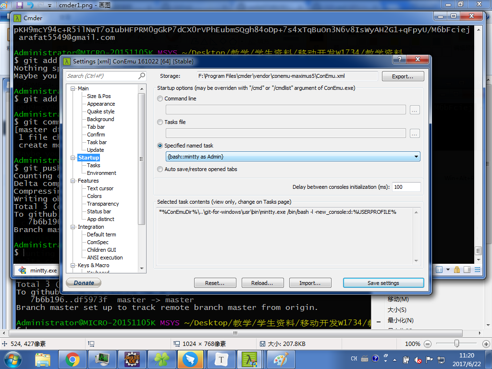

###### H1-H6

# H1

### Cmder

- 什么是Cmder?
  - 命令行工具整合WIndows和Linux的命令行
- 怎么使用Windows命令行?
  - 在启动界面 输入cmd
  - 在对应的文件 shift+右键    弹出Context   选择在此打开命令窗口
  - 
  - 

### GIT  版本控制软件

- 基本等同于SVN 
- [GIT教程](http://www.liaoxuefeng.com/wiki/0013739516305929606dd18361248578c67b8067c8c017b000/001373962845513aefd77a99f4145f0a2c7a7ca057e7570000)
- github 网络仓库 我把代码或者文件上传上去 你们就可以下载
- 去github注册一个账号 https://github.com/
- ​

### 常用的命令 Liunx版本

- [Java开发必会的Linux命令](http://www.hollischuang.com/archives/800)

- cd
  - 进入对应的文件夹
  - cd -   返回上一次的目录
  - cd ..  返回上一级目录
- echo  回声
  - 相当于我们java的的print
  - 两种取变量  win: %PATH% ;  linux : $PATH
- history
  - 记录500条我们输入过的命令
- source
  - Linux加载配置 source ~/.bashrc
- ~ 波浪号不是命令 是你HOME路径的简写
- pwd
  - 打印当前文件路径

### 为什么需要配置环境变量:

- 为什么JDK需要配置环境变量
  - 这样你就可以在任意目录 执行对应的可执行文件 比如java.exe
  - 如果不配置环境变量的话 你需要每次都cd到对应可执行文件所在的bin目录
  - PATH环境变量包含了好多个文件夹, 它会一个个文件夹进行查找，如果找到了就不会查找后面的文件夹

