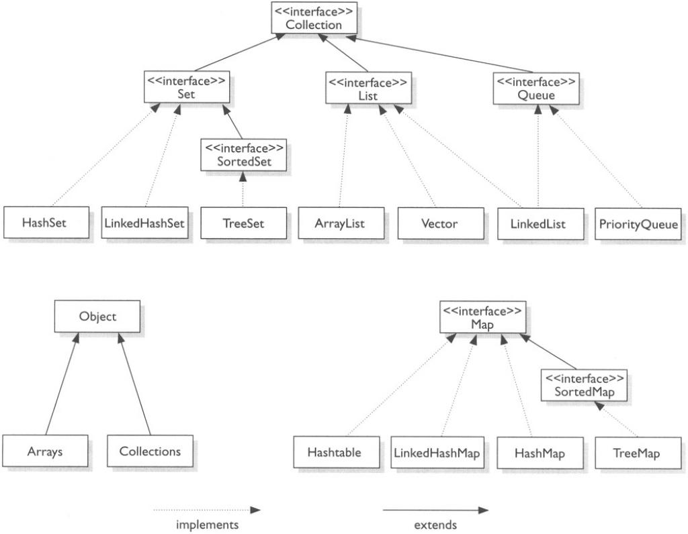
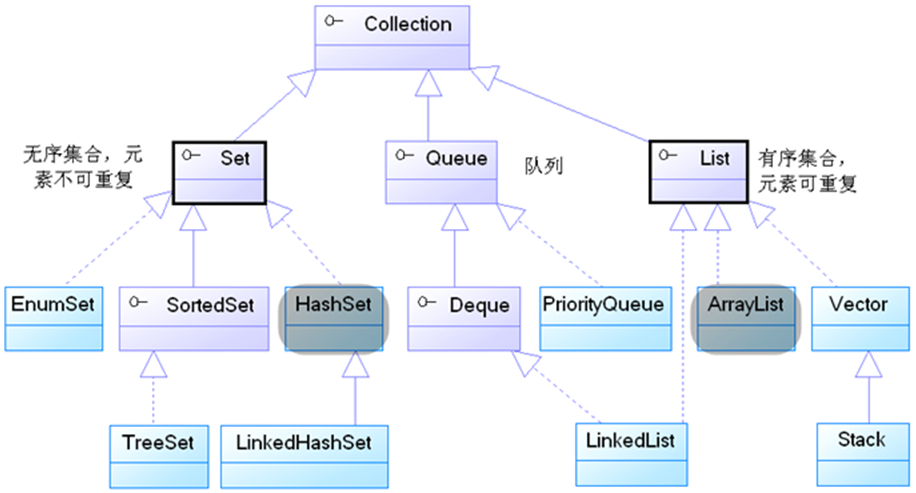

### 数据结构

API示例图:

**接口Collection:**

#### Java集合Collection接口包含以下几种接口:

- **List**
  - ArrayList
  - LinkedList
    - **Stack栈结构**
- **Set**
  - HashSet
  - LinkedHashSet
  - TreeSet
- **Queue**

### Map(键值对)是一个独立的接口包含:

- HashMap
- LinkedHashMap
- TreeMap

#### Java的集合类包含了两个工具类

- Arrays  数组的工具类
- Collections  集合的工具类

### 经典面试问题:

- ArrayList, LinkedList, Vector的区别是什么？
- ArrayList和LinkedList 怎么实现栈结构Stack和队列结构Queue?
- Map, Set, List, Queue、Stack的特点及用法。?
- HashMap和HashTable的区别?
- TreeMap, LinkedHashMap, HashMap的区别是什么？
- HashMap的实现原理
- 夺命连环call:
  1. HashMap是有序的吗？
  2. 有没有有序的Map结构?
  3. TreeMap和LinkedHashMap怎么保证它的顺序？
  4. 你觉得哪一种排序的方式更好?
- 夺命连环call 2:
  1. HashMap是线程安全的吗?
  2. 有没有线程安全的Map结构?
  3. 他们是怎么实现线程安全？
  4. 你觉得哪一种比较好?